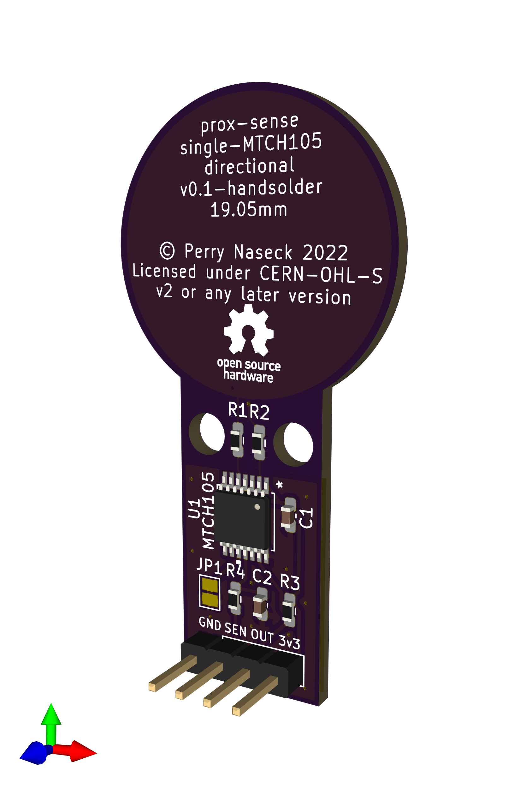

prox-sense
==========

[prox-sense](https://github.com/DaAwesomeP/prox-sense) is a series of printed
circuit board (PCB) designs for designed to bring robust and discreet
capacitive proximity and touch sensing to artists and makers.

**Video demonstration and poster: [Hidden Touch: Open Source Sensors for New
Interaction](https://perrynaseck.com/work/prox-sense/)**

This repository contains the KiCAD schematics, boards, and Gerber files
required to produce the sensing boards. License notice below.

## Premise

**Existing systems for creating interactive experiences:**

 - Expensive
 - Can be difficult to use or understand
 - Limited or nonexistent proximity detection (existing capacitive options)
 - Dense arrangements of proximity sensors may not function (existing
   capacitive options)
 - Connectivity options do not scale up to large systems of sensors
 - Equivalent/alternative optical systems are intrusive, expensive, or
   predictable (cameras, vision systems)
 - Require large amounts of processing or setup
 - Existing tactile systems are predictable (buttons, knobs, touchscreens,
   etc.)

**prox-sense promotes discoverable and new interactions:**

 - Inexpensive
 - Focus on proximity detection
 - Proximity through solid and opaque objects (sensors can be entirely hidden)
 - Directional proximity detection options allow for dense arrangements
 - Interaction is led by the objects the sensors are hidden in and the
   resulting interactions, not the sensors and sensor limitations
 - Small sensors allow for small detection areas and objects
 - Simple connectivity scales up to large systems without limiting the maximum
   number of easily-connected sensors
 - Open source and free to produce

## Boards

Currently all boards are based around the [Microchip
MTCH105](https://www.microchip.com/en-us/product/MTCH105)

 - Simple GPIO interface for detection and sensitivity adjustment. The standard
   logic output can be used directly with microcontrollers, logic circuits,
   transistors, muxes, and port expanders
 - Rejects liquids and other uncertain signal sources
 - Supports guard reference signal for solid interference mitigation
 - All boards currently use the same schematic but vary the copper/trace layout
   to achieve different detection patterns

### Directional board

 - Detects proximity and touch only directly in front of the sensors
 - Rejects rear and off-axis (side) detection using guard signal
 - Guard signal on edge allows for close-packing of sensors

### Omnidirectional board

 - Detects proximity and touch from all directions
 - Guard signal on edge allows for close-packing of sensors

## License Notice
Copyright Perry Naseck 2022.

This source describes Open Hardware and is licensed under the CERN-OHL-S v2.

You may redistribute and modify this source and make products using it under
the terms of the CERN-OHL-S v2 (https://ohwr.org/cern_ohl_s_v2.txt).

This source is distributed WITHOUT ANY EXPRESS OR IMPLIED WARRANTY,
INCLUDING OF MERCHANTABILITY, SATISFACTORY QUALITY AND FITNESS FOR A
PARTICULAR PURPOSE. Please see the CERN-OHL-S v2 for applicable conditions.

Source location: https://github.com/DaAwesomeP/prox-sense

As per CERN-OHL-S v2 section 4, should You produce hardware based on this
source, You must where practicable maintain the Source Location visible
on the external case of the prox-sense or other products you make using this
source.
